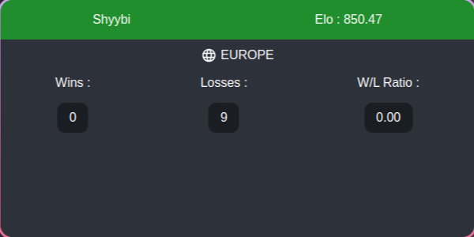

# SSBM Ranked Overlay

This is a simple overlay for SSBM ranked games. It displays the current game and the players' ranks.
##  Pre Installation 

1. Download [NodeJS](https://nodejs.org/)

## Installation

1. Clone the repository
2. Run the command " npm install "
3. Setup your Slippi's code in the config.json file
4. Run the build.

    For windows: `npm run build:win`    
    For linux: `npm run build:linux`    
    For mac: `npm run build:mac`    

5. in the dist folder, you will find the overlay for your OS. (the folder : `melee-ranked-overlay/dist/*-unpacked/` )

## Contributing

If you want to contribute to this project, please open an issue or a pull request.

